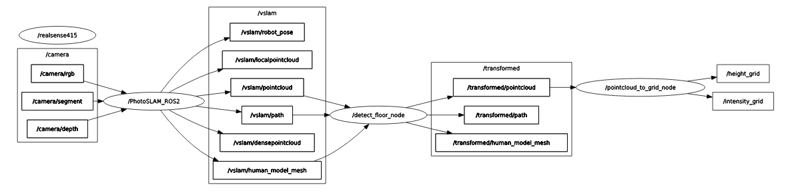

# Visual-SLAM

In this project, we present two major contributions:

- Deploying Photo-SLAM on ROS for a custom-developed robotic platform
- Enhancing Photo-SLAM with a segmentation module to enable functionality in dynamic environments

For more detailed technical information, please refer to [the project report](https://drive.google.com/file/d/1qOToDDBGuiGscc_OUq-asIhoBLoVRoQQ/view?usp=sharing).

[](https://www.youtube.com/watch?v=Wm5wNn92kFc)

## Structure

The source code is organized as follows:

```bash
ros2_ws/src
- controller
- pointcloud_to_grid
- realsense_reader
- vslam

masked-photo-slam
```

The `masked-photo-slam` directory contains a modified version of Photo-SLAM that is capable of handling RGBD data along with mask information. The ROS2 packages have the following roles:

- `controller`: Normalizes the output data from the Photo-SLAM algorithm into a format that can be used by our custom robotic platform.
- `pointcloud_to_grid`: Converts pointcloud data into an intensity map to facilitate obstacle avoidance.
- `realsense_reader`: Supports data collection from the Realsense camera (we use the D415), either saving it as ROS bags or streaming it to topics.
- `vslam`: Operates the `masked-photo-slam` algorithm along with a segmentation block based on YOLOv8.

The operation pipeline is as follows:



- Images captured by the Realsense D415 are published to the `camera/` topic group.
- The `rgbd_node` performs segmentation and runs the masked-photo-slam algorithm, streaming the output to the `vslam/` topic group.
- The `normalise_data` node standardizes the data and publishes it to the `transformed/` topic group.

The robot control system can use the information from the `transformed/` topic group to intelligently avoid obstacles.

## How to Run

### Hardware

We achieved real-time performance on the Jetson Orin AGX (64GB RAM & VRAM). Here are a few important notes:

- Our VSLAM system requires real-time operation. If the CPU is overloaded, the computation will skip some frames, potentially leading to a "Fail to track local map!" error.
- The system will also halt automatically if it runs out of memory on RAM or VRAM.

### Setup

- Install the necessary environment by following the instructions in the Photo-SLAM repository README.
- Install TensorRT by following the instructions [here](https://docs.nvidia.com/deeplearning/tensorrt/install-guide/index.html#downloading).
- Install ROS2 suitable for your operating system version [here](https://docs.ros.org/en/crystal/Installation/Linux-Install-Binary.html).
- Set up the paths to the packages: You need to search for "TODO" throughout the entire system to find the places where the path needs to be changed. (TODO: use a configuration mechanism for the entire project.)

### Running the System

Before starting, connect the Realsense camera to your device.

1. Build the software:
   - Build the masked-Photo-SLAM algorithm:

     ```bash
     cd masked-Photo-SLAM
     ./build.sh
     ```

   - Build the ROS2 packages:

     ```bash
     cd ros2_ws
     colcon build --symlink-install
     source install/setup.bash
     ```

2. Collect a ROS bag to store the image data stream (optional):

   If you want to collect a fixed dataset for repeated use with the algorithm, you need to collect data in ROS bag format.

   ```bash
   ros2 run realsense_reader stream [1 if segment else 0] [1 if record else 0]
   ```

   To store as a ROS bag, use the options `0 1` or `1 1`. The ROS bag will be saved into a folder named **record_bag** at the location where you run the command. Note: segmenting during data collection is optional as it is by default performed in VSLAM.

3. Open multiple terminal windows and run the following commands:

   ```bash
   # Run vslam
   ros2 run vslam rgbd

   # Run normalise_data
   ros2 run controller normalise_data

   # Run pointcloud_to_grid
   ros2 launch pointcloud_to_grid demo.launch.py topic:=/transformed/pointcloud
   ```

   With these commands, you can observe the operation of the masked-photo-slam through the visualizer that pops up on the screen.

4. Display normalized information using RVIZ:

   To easily view and interact with the output of the algorithm, use the RVIZ visualizer in ROS.

   ```bash
   rviz2
   ```

   Select "Add" and then "By topic" to add the information you want to see. To view the unprocessed output of the masked-photo-slam algorithm, select all topics in the `vslam/` group. To view the normalized data, select all topics in the `transformed/` group and the `intensity_map/` topic.

5. Create an image stream to start the algorithm:

   You have two options to create an image stream:

   **Option 1**: Create an image stream from a ROS bag

   - In step 2, you collected a ROS bag using the Realsense camera.
   - Create an image stream with the ROS bag:

     ```bash
     ros2 bag play path/to/your/ros/bag/folder
     ```

   **Option 2**: Use a direct image stream from the Realsense camera

   ```bash
   ros2 run realsense_reader stream 0 0
   ```

## Reference

- [Photo-SLAM](https://huajianup.github.io/research/Photo-SLAM/)
- [Masked ORB-SLAM3](https://github.com/labourer-Lucas/YOLOv8_Masked_ORB_SLAM3)
- [YOLO from Ultralytics](https://github.com/ultralytics/ultralytics)
- [Pointcloud to grid package](https://github.com/jkk-research/pointcloud_to_grid)
